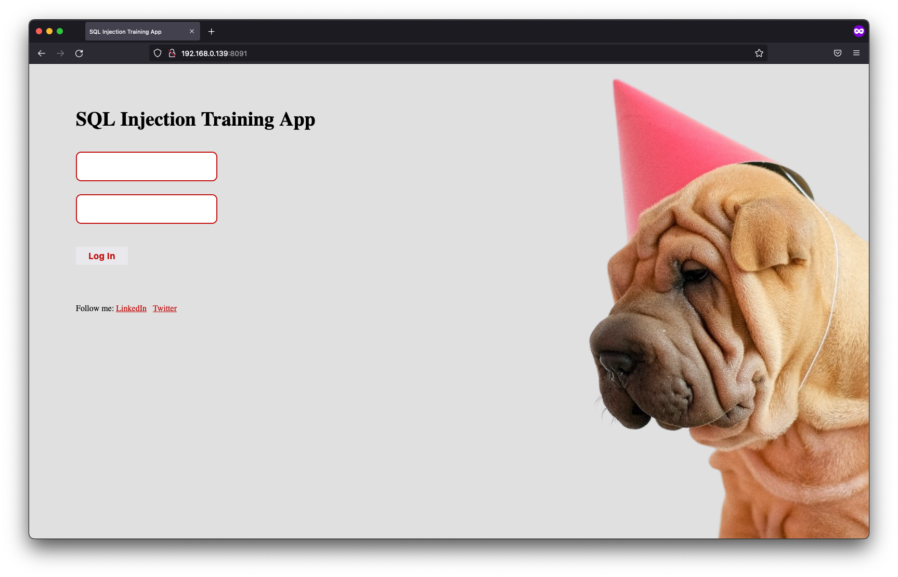
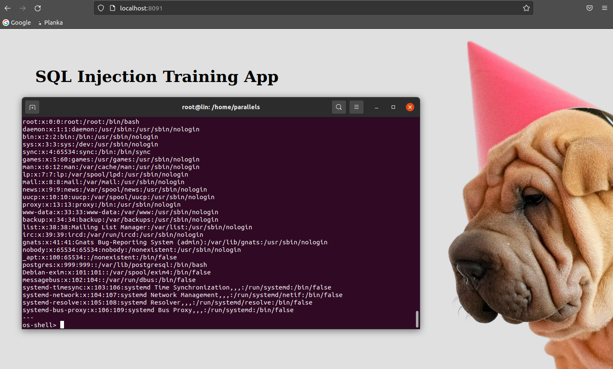

## Vulnerable Web App: sqli-postgres-rce-privesc-hacking-playground

This is free vulnerable app for novice pentesters & developers to experiment with SQL Injection vulnerability and privilege escalation. 

Recommended path:
1. exploit the SQLi vulnerability
2. get shell via vulnerable version of PostgreSQL
3. perform privilage escalation and become root 🥂

Applications can be exploited in many different ways:




## How to use it - DOCKER

1 minute installation on a virtual machine or VPS with Linux.

```
Linux@amd64 (Intel processors):
docker run -p 8091:80 -d filipkarc/sqli-postgres-rce-privesc-hacking-playground


Linux@AppleSilicon (tested on Apple M1):
docker run -p 8091:80 -d filipkarc/sqli-postgres-rce-privesc-hacking-playground:arm64apple

```

After 2 minutes, it should be visible in the browser: http://127.0.0.1:8091


## Contact

Feel free to contact me on [Twitter @FilipKarc](https://twitter.com/FilipKarc).

Be sure to follow me on LinkedIn: [LinkedIn](https://www.linkedin.com/in/filip-karczewski/).


  
